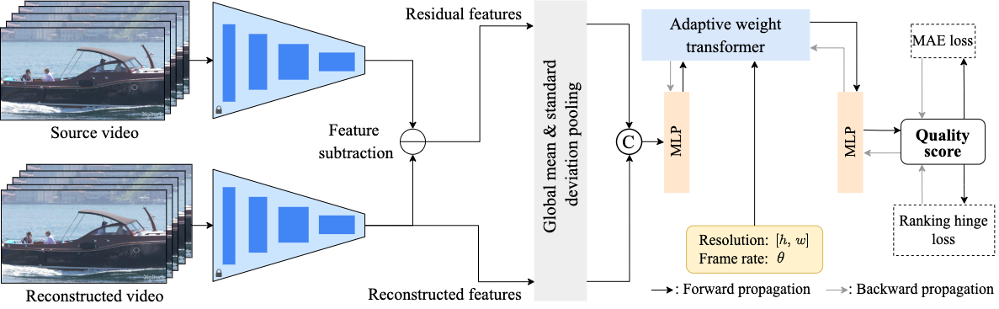

# STRA-VQA
This repository contains the offical implementations along with the experimental splits for the paper "[Video Quality Assessment for Spatio-Temporal Resolution Adaptive Coding](https://ieeexplore.ieee.org/document/****)", Hanwei Zhu, Baoliang Chen, Lingyu Zhu, Peilin Chen, Linqi Song and [Shiqi Wang](https://www.cs.cityu.edu.hk/~shiqwang/).


## Framework


### Prerequisites
The release codes were implemented and have been tested in Ubuntu 18.04 with
- Python = 3.6.13
- PyTorch = 1.8.1
- torchvision = 0.9.0 

## Feature extraction
More details can be found in README.md in the folder of `extract_features`.

## Training on VQA Databases
You can change the paramers in `param.py` to train each dataset with intra-/cross-dataset settings:
```bash
python main.py --test_only False
```

## Testing on VQA Databases
You can change the paramers in `param.py` to train and test each dataset, and the trained parameters of the proposed model on each dataset can be found at [Google Drive](https://drive.google.com/drive/folders/1BM3KVvBWTPFI0OKlEJLS-yRzhXqioY34?usp=sharing): 
```bash
python main.py --test_only True
```


## Citation
```bibtex
@article{zhu2022learing,
title={Video Quality Assessment for Spatio-Temporal Resolution Adaptive Coding},
author={Zhu, Hanwei and Chen, Baoliang and Zhu, Lingyu and Chen, Peilin and Song, Lingqi and Wang, Shiqi},
journal={},
volume={},
number={},
pages={},
month={},
year={}
}
